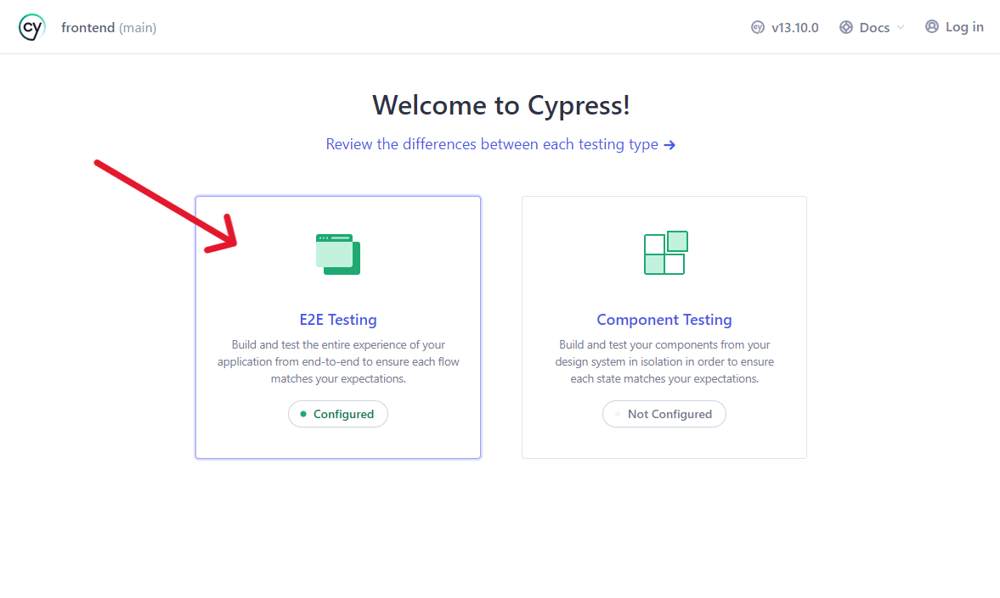
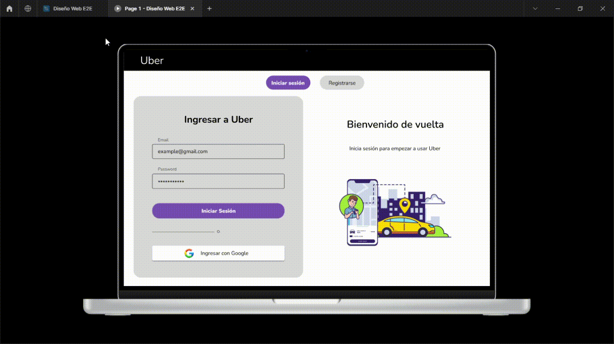

# 📋 Proyecto E2E - Entrega 5: Frontend web con React

## Descripción 💡

Este laboratorio se centra en desarrollar la página web para el Backend del clon de Uber. Constará de una página de Login/Register para cada rol de usuario, así como un dashboard para visualizar el historial de viajes de cada usuario.

En esta entrega deberás:

- Desarrollar la página web con el paradigma basado en componentes con ayuda del framework de frontend [**React**](https://react.dev)
- Implementar el consumo de la API del E2E con ayuda de la librería [**Axios**](https://axios-http.com/es/)
- Clonar el diseño de la web del E2E con ayuda del framework de CSS [**Tailwind**](https://tailwindcss.com/)

## Requerimientos ✅

Tener instalado:
+ Runtime de Javascript [**Node.js**](https://nodejs.org/en) (v20 o superior)
+ Gestor de paquetes de Node [**npm**](https://www.npmjs.com/package/npm) (v9 o superior)

Investigar sobre:
+ La herramienta de desarrollo [**Vite**](https://vitejs.dev)
+ Framework de CSS [**Tailwind**](https://tailwindcss.com/)

## Evaluación 📋

La evaluación se divide en dos partes:
1. **Diseño (5 pts)**
    - **Estilos**: Deberás clonar o asemejar el diseño de la web del E2E con ayuda de Tailwind. Tomar como referencia el [Prototipo del E2E](#prototipo-en-figma)
    - **Usabilidad**: Implementar un diseño intuitivo y fácil de usar para el usuario.
    - **Responsividad**: (OPCIONAL) Implementar un diseño responsivo para la página web.
2. **Funcionalidad (15 pts)**
   - **Login/Register**: Deberás implementar la funcionalidad de `Login` y `Register` para cada rol de usuario. 
   - **Dashboard**: Deberás implementar la funcionalidad de visualizar el historial de `Rides` de cada usuario.
   - **Consumo de API**: Deberás consumir la API del E2E para obtener los datos necesarios.

> ⚠️⚠️ **Importante:** No modificar ningún atributo `id` de los elementos HTML, ya que son necesarios para ejecutar los test del autograder. 


## Getting Started 🚀

En la raíz verán dos carpetas: `backend` y `frontend`. 

- En la carpeta de `backend` se encuentra la API de Spring Boot realizada en los laboratorios e2e anteriores. 
- En la carpeta de `frontend` se encuentra el proyecto de React-Vite que consumirá el backend.

### Cambios en Spring Boot ❗
Para que el frontend pueda consumir la API de Spring Boot, se creó un nuevo archivo de configuración en la carpeta `config/CorsConfig.java`, el cual desactiva la política de CORS para que el frontend pueda consumir la API sin problemas.

Código de `CorsConfig.java`:
```java
@Configuration
public class CorsConfig {
    @Bean
    public WebMvcConfigurer corsConfigurer() {
        return new WebMvcConfigurer() {
            @Override
            public void addCorsMappings(CorsRegistry registry) {
                // Disable Cors Origin to React frontend
                registry.addMapping("/**").allowedOrigins("http://127.0.0.1:5173");
            }
        };
    }
}
```

### Ejecutar el proyecto de Spring Boot ▶️
Antes de ejecutar el proyecto de React-Vite, es necesario ejecutar el proyecto de Spring Boot para que la API esté disponible. Pueden abrirlo desde IntelliJ IDEA en la carpeta `backend` y ejecutarlo desde ahí. Asegurarse que su proyecto esté corriendo en el puerto `8080`.

### Organización de carpetas 📂
El proyecto de **fronend** está organizado de la siguiente manera:

``` markdown
frontend/
├── cypress/              # Carpeta de Cypress (Testing)
│ └── e2e/                # Archivos de testing 
├── node_modules/         # Dependencias del proyecto
├── public/               # Archivos estáticos de la aplicación
├── src/                  # Archivos de código fuente de la aplicación 
│ ├── assets/             # Archivos multimedia 
│ ├── components/         # Componentes de la aplicación
│ ├── layout/             # Componentes plantilla de la aplicación
│ ├── pages/              # Páginas principales
│ ├── service/            # Archivos de configuración de Axios
│ ├── styles/             # Estilos globales y de componentes
│ │ └── index.css
│ ├── App.jsx             # Archivo principal 
│ └── main.jsx            # Archivo de inicialización          
├── .gitignore
├── cypress.config.js     # Archivo de configuración de Cypress 
├── index.html            # Archivo HTML principal
├── package.json          # Archivo de configuración de dependencias
├── tailwind.config.js    # Archivo de configuración de Tailwind
└── vite.config.js        # Archivo de configuración de Vite
```

### Ejecutar el proyecto de React-Vite 🪽

Escribir los siguientes comandos en la terminal para cargar las dependencias del proyecto y ejecutar el servidor de React-Vite

```bash
cd frontend
npm install
npm run dev
```
  
Les aparecerá un mensaje similar a este:

```bash  
 VITE v5.2.11  ready in 429 ms

  ➜  Local:   http://localhost:3000/
  ➜  Network: http://192.168.0.11:3000/
  ➜  Network: http://172.31.96.1:3000/
  ➜  press h + enter to show help
```

Pueden acceder a su frontend desde el navegador en la dirección [http://localhost:3000/](http://localhost:3000/)

> **Nota:** el puerto puede variar dependiendo de la configuración de Vite.

### Ejecutar el test de Cypress 🧪

Para ejecutar los test de Cypress y probar tu avance, escribir el siguiente comando en la terminal:

```bash
npx cypress open
```

Luego, te aparecerá la interfaz de Cypress. Seguir los siguientes pasos para probar tu avance:




## Diseño (5pts) 🖌️
El diseño es una parte fundamental en el desarrollo de software, ya que es lo primero que ve el usuario al interactuar con la aplicación. No obstante, en el curso de CS2031 no será indispensable tener un diseño perfecto, pero sí funcional.  

Se recomienda clonar el diseño del prototipo del E2E con ayuda de Tailwind. **Pero puedes crear tu propio diseño si lo deseas**.

### Prototipo en Figma
El prototipo en Figma es una guía visual para que puedan clonar el diseño de la web del E2E. Pueden acceder a él desde este enlace: [**Prototipo web del E2E**](https://www.figma.com/community/file/1374595433604097313/diseno-web-e2e-cs2031-utec)



### Estructura de rutas y enrutamiento del Frontend 🌎
- `/auth/login`: Página de inicio de sesión para los usuarios.
  - Al hacer login, deberá redirigir a la página `/dashboard`.
  - Tendrá que enrutarse a esta página siempre y cuando el usuario no esté autenticado.
  - También deberá enrutarse a esta página cuando el usuario haga logout.
  - La ruta principal `/` deberá redirigir a esta página.
- `/auth/register`: Página de registro para los usuarios.
   - Si el usuario selecciona el rol de `Passenger`, deberá redirigir a la página `/dashboard`.
   - Si el usuario selecciona el rol de `Driver`, deberá redirigir a la página `auth/register/vehicle`. 
- `/auth/register/vehicle`: Página de registro del vehículo para los conductores.
  - Al hacer login, deberá redirigir a la página `/dashboard`.
- `/dashboard:` Página principal para visualizar el dashboard del usuario.
  - Si el usuario es un `Passenger`, deberá mostrar el historial de viajes y su pefil.
  - Si el usuario es un `Driver`, deberá mostrar el historial de viajes, su perfil y la información del vehículo.
  - Al hacer logout, deberá redirigir a la página `/auth/login`.
  - Tendrá que enrutarse a esta página siempre y cuando el usuario esté autenticado.
  - Al editar el perfil del usuario, deberá redirigir a la página `/profile/edit`.
  - Al editar el vehículo del conductor, deberá redirigir a la página `/vehicle/edit`.
- `/profile/edit:` Página para editar la información del usuario.
  - Al hacer click en editar, deberá redirigir a `/dashboard`.
- `/vehicle/edit:` Página para editar la información del vehículo del conductor.
  - Al hacer click en editar, deberá redirigir a `/dashboard`.

## Funcionalidad (15pts) 💻

### Tarea 1 ✏️
Creación de los fetchs hacia la api de SpringBoot con JavaScript y Axios

### Tarea 2 ✏️
Obtención de datos desde los formularios con React Hooks

### Tarea 3 ✏️
Mostrar datos del backend en Componentes de React

### Tarea 4 ✏️
Enviar datos desde el frontend hacia el backend
